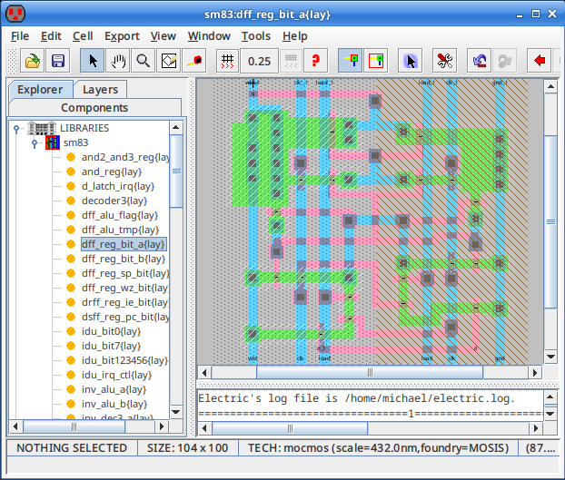
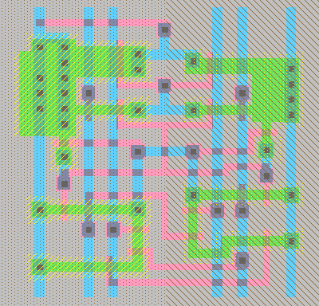

CIF file converter
==================

CSharp application for converting Caltech Intermediate Format (CIF) files to PNG images. CIF is a possible export
option in Electric VLSI for exporting layouts.

Read [INSTALL](INSTALL) for build/install instructions.


Usage
-----

Generate PNG image containing all layers:
```
cifconv --png output.png input.cif
```


Example
-------

Cell in Electric VLSI:



Can be exported by choosing "File"->"Export"->"CIF (Caltech Intermediate Format)..." from the menu. Then running cifconv
will result in the following PNG image.

```
cifconv --png dff_reg_bit_a.png dff_reg_bit_a.cif --width 400 --bg ffc0c0c0
```




Options
-------

| Option                                                                  | Description                                                                                                                                                                                                                                                                                                                                                                                                                                                      |
| ----------------------------------------------------------------------- | ---------------------------------------------------------------------------------------------------------------------------------------------------------------------------------------------------------------------------------------------------------------------------------------------------------------------------------------------------------------------------------------------------------------------------------------------------------------- |
| <code>&#x2011;&#x2011;png&nbsp;&lt;FILE&gt;</code>                      | Specify output file `<FILE>` for PNG image generation. If `<FILE>` is `-`, standard output is used.                                                                                                                                                                                                                                                                                                                                                              |
| <code>&#x2011;&#x2011;style&nbsp;&lt;STYLE&gt;</code>                   | Choose drawing style of PNG image. `<STYLE>` can be one of: <code>electric&#x2011;cmos</code>, <code>electric&#x2011;mocmos</code> *(default)*, <code>electric&#x2011;mocmos&#x2011;print</code>, <code>electric&#x2011;nmos</code>, <code>electric&#x2011;rcmos</code>, <code>electric&#x2011;rcmos&#x2011;print</code> or `mask`                                                                                                                               |
| <code>&#x2011;&#x2011;layer&nbsp;&lt;LAYER&gt;</code>                   | Select one layer to operate on. If not given, all layers are selected.                                                                                                                                                                                                                                                                                                                                                                                           |
| <code>&#x2011;&#x2011;whitelist&nbsp;&lt;LAYERS&gt;</code>              | List of layers to draw.                                                                                                                                                                                                                                                                                                                                                                                                                                          |
| <code>&#x2011;&#x2011;blacklist&nbsp;&lt;LAYERS&gt;</code>              | List of layers not to draw.                                                                                                                                                                                                                                                                                                                                                                                                                                      |
| <code>&#x2011;&#x2011;scale&nbsp;&lt;SCALE&gt;</code>                   | Choose scale factor. If not given, a scale of 1.0 will be used, unless <code>&#x2011;&#x2011;width</code> or <code>&#x2011;&#x2011;height</code> is given. In that case, a scale factor is chosen, which makes everything fit into the given width/height frame.                                                                                                                                                                                                 |
| <code>&#x2011;&#x2011;origin-x&nbsp;&lt;XCOORD&gt;</code>               | Choose X coordinate of new origin point. This defines the X coordinate (after the scale factor is applied) of the top left corner of the output image. If not given, the min value (left boundary) of all X coordinates is taken, so that everything is visible in the output image.                                                                                                                                                                             |
| <code>&#x2011;&#x2011;origin-y&nbsp;&lt;YCOORD&gt;</code>               | Choose Y coordinate of new origin point. This defines the Y coordinate (after the scale factor is applied) of the top left corner of the output image. If not given, the max value (top boundary) of all Y coordinates is taken, so that everything is visible in the output image.                                                                                                                                                                              |
| <code>&#x2011;&#x2011;width&nbsp;&lt;XSIZE&gt;</code>                   | Choose width of image in pixels. If not given, the image will be as wide as necessary to make everything visible with the given scale factor. If scale factor is not manually specified, then the maximum width will be 16,384 pixels and the scale factor will be adjusted to make the image fit.                                                                                                                                                               |
| <code>&#x2011;&#x2011;height&nbsp;&lt;YSIZE&gt;</code>                  | Choose height of image in pixels. If not given, the image will be as high as necessary to make everything visible with the given scale factor. If scale factor is not manually specified, then the maximum height will be 16,384 pixels and the scale factor will be adjusted to make the image fit.                                                                                                                                                             |
| <code>&#x2011;&#x2011;bg&nbsp;&lt;AARRGGBB&gt;</code>                   | Choose PNG background color. 00000000 is default.                                                                                                                                                                                                                                                                                                                                                                                                                |
| <code>&#x2011;&#x2011;at&nbsp;[png]&lt;COORD&gt;[@&lt;LAYER&gt;]</code> | Highlight object(s) at coordinate at optionally given layer. If prefixed by `png`, coordinates are given in the transformed final image space.                                                                                                                                                                                                                                                                                                                   |
| <code>&#x2011;&#x2011;roundgrowing</code>                               | Use alternative rounding style instead of rounding to the nearest integer. For example, the corner coordinates of rectangular boxes will be rounded in a way that makes the box larger rather than smaller. The smaller one of the two corner coordinates are rounded down, the larger one is rounded up. This can help to reduce the likelihood of small unintentional gaps due to rounding, but it may cause misalignment of box corners with polygon corners. |

If no input files are given, standard input is read.

<code>&#x2011;&#x2011;layer</code> can be used to select a single layer for drawing. <code>&#x2011;&#x2011;whitelist</code>
can be used to select multiple layers to be drawn. The difference between the two is, <code>&#x2011;&#x2011;whitelist</code>
will only draw layers that are supported by the selected drawing style (<code>&#x2011;&#x2011;style</code>), whereas
<code>&#x2011;&#x2011;layer</code> will force a layer to be drawn, even if it is not supported by the selected drawing
style. In the latter case, unsupported layers are usually drawn in solid black. If neither <code>&#x2011;&#x2011;layer</code>
nor <code>&#x2011;&#x2011;whitelist</code> is given, all layers supported by the selected drawing style are drawn, except for
those listed by <code>&#x2011;&#x2011;blacklist</code>. <code>&#x2011;&#x2011;blacklist</code> has precedence over
<code>&#x2011;&#x2011;whitelist</code>.

Coordinates of each shape in the CIF will be transformed in the following order:
1. Scale factor is applied. If scale factor is not specified by <code>&#x2011;&#x2011;scale</code> option, then scale
   factor is determined automatically to make the image fit into bounds given by <code>&#x2011;&#x2011;width</code> and
   <code>&#x2011;&#x2011;height</code> options.
2. Origin translation is applied. If <code>&#x2011;&#x2011;origin-*(x|y)*</code> options are not specified, then origin is
   determined automatically to shift everything into the visible bounds of the output image.
3. Invert Y coordinate. (CIF Y coordinates grow from bottom to top. Image Y coordinates grow from top to bottom.)


Layers
------

The following table describes all layers and which CIF layers are being mapped to them.

| Layer                                     | From CIF                 | Description                                                                                                                                                                                                                                                                                                             |
| ----------------------------------------- | ------------------------ | ----------------------------------------------------------------------------------------------------------------------------------------------------------------------------------------------------------------------------------------------------------------------------------------------------------------------- |
| `active`                                  | `CAA`, `CD`              | Active/diffusion area with unspecified doping. In most fabrication technologies, this layer describes P and N doped active areas. It is usually where no insulation (SiO2) is grown. The actual doping is then chosen later in the process by the <code>p&#x2011;select</code> and <code>n&#x2011;select</code> layers. |
| <code>p&#x2011;active</code>              | `CAP`                    | P doped active/diffusion area.                                                                                                                                                                                                                                                                                          |
| <code>n&#x2011;active</code>              | `CAN`                    | N doped active/diffusion area.                                                                                                                                                                                                                                                                                          |
| `select`                                  | `CSG`                    | Selection mask for stronger ion bombardment with unspecified direction (P/N).                                                                                                                                                                                                                                           |
| <code>p&#x2011;select</code>              | `CSP`, `CS`              | Selection mask for stronger ion bombardment for P doping active areas.                                                                                                                                                                                                                                                  |
| <code>n&#x2011;select</code>              | `CSN`                    | Selection mask for stronger ion bombardment for N doping active areas.                                                                                                                                                                                                                                                  |
| `well`                                    | `CWG`                    | Well with unspecified doping.                                                                                                                                                                                                                                                                                           |
| <code>p&#x2011;well</code>                | `CWP`, `CW`              | P doped well.                                                                                                                                                                                                                                                                                                           |
| <code>n&#x2011;well</code>                | `CWN`                    | N doped well.                                                                                                                                                                                                                                                                                                           |
| `poly`                                    | `CPG`, `CP`, `NP`        | Polysilicon 1 layer. This is the lowest polysilicon layer. It can function as transistor gates.                                                                                                                                                                                                                         |
| `electrode`                               | `CEL`                    | Polysilicon 2 layer. Often used as electrode of capacitors, hence the name.                                                                                                                                                                                                                                             |
| `metal1`                                  | `CMF`, `CM`, `NM`        | Metal 1 layer. The lowest metal layer. The only metal layer that can make contact down to poly or active.                                                                                                                                                                                                               |
| `metal2`                                  | `CMS`                    | Metal 2 layer.                                                                                                                                                                                                                                                                                                          |
| `metal3`                                  | `CMT`                    | Metal 3 layer.                                                                                                                                                                                                                                                                                                          |
| `metal4`                                  | `CMQ`                    | Metal 4 layer.                                                                                                                                                                                                                                                                                                          |
| `metal5`                                  | `CMP`                    | Metal 5 layer.                                                                                                                                                                                                                                                                                                          |
| `metal6`                                  | `CM6`                    | Metal 6 layer.                                                                                                                                                                                                                                                                                                          |
| `contact`                                 | `CCG`, `CCC`, `CC`, `NC` | Contact between metal 1, polysilicon/electrode and active layers. Many technologies don't differentiate between poly and active contacts. Contacts are also known as cuts.                                                                                                                                              |
| <code>active&#x2011;contact</code>        | `CCA`                    | Contact between metal 1 and active layer.                                                                                                                                                                                                                                                                               |
| <code>poly&#x2011;contact</code>          | `CCP`                    | Contact between metal 1 and polysilicon 1 layer.                                                                                                                                                                                                                                                                        |
| <code>electrode&#x2011;contact</code>     | `CCE`                    | Contact between metal 1 and polysilicon 2 (aka. electrode) layer.                                                                                                                                                                                                                                                       |
| <code>oversize&#x2011;contact</code>      | `NO`                     | The NMOS technology in Electric VLSI has this layer. Oversized contacts between metal 1 and poly or active probably need special handling in some fabrication technologies.                                                                                                                                             |
| `buried`                                  | `CCD`, `NB`              | Opening in the insulation between active and polysilicon 1. Used to create buried contacts between those layers without the need to connect both to metal 1.                                                                                                                                                            |
| `via1`                                    | `CVA`                    | Via 1 layer. Connection between metal 1 and metal 2. For some technologies, this layer may be used for all vias, in which case vias will connect from metal 1 all the way through to the highest metal layer.                                                                                                           |
| `via2`                                    | `CVS`                    | Via 2 layer. Connection between metal 2 and metal 3.                                                                                                                                                                                                                                                                    |
| `via3`                                    | `CVT`                    | Via 3 layer. Connection between metal 3 and metal 4.                                                                                                                                                                                                                                                                    |
| `via4`                                    | `CVQ`                    | Via 4 layer. Connection between metal 4 and metal 5.                                                                                                                                                                                                                                                                    |
| `via5`                                    | `CV5`                    | Via 5 layer. Connection between metal 5 and metal 6.                                                                                                                                                                                                                                                                    |
| <code>p&#x2011;high&#x2011;voltage</code> | `CVP`                    | Defined in the MOSIS SCMOS Design Rules.                                                                                                                                                                                                                                                                                |
| <code>n&#x2011;high&#x2011;voltage</code> | `CVN`                    | Defined in the MOSIS SCMOS Design Rules.                                                                                                                                                                                                                                                                                |
| <code>thick&#x2011;active</code>          | `CTA`                    | Used by Electric VLSI to define a wider area around the select layer of thick P/N MOS transistors, which are called high-voltage resistors in the log.                                                                                                                                                                  |
| <code>mems&#x2011;open</code>             | `COP`                    | Defined in the MOSIS SCMOS Design Rules.                                                                                                                                                                                                                                                                                |
| <code>mems&#x2011;etch&#x2011;stop</code> | `CPS`                    | Defined in the MOSIS SCMOS Design Rules.                                                                                                                                                                                                                                                                                |
| `pad`                                     | `CX`, `XP`               | Bonding or test pad.                                                                                                                                                                                                                                                                                                    |
| <code>exp&#x2011;field&#x2011;impl</code> | `CFI`                    | Defined in the MOSIS SCMOS Design Rules.                                                                                                                                                                                                                                                                                |
| <code>poly&#x2011;cap</code>              | `CPC`                    | Defined in the MOSIS SCMOS Design Rules.                                                                                                                                                                                                                                                                                |
| <code>silicide&#x2011;block</code>        | `CSB`                    | Silicide block layer. Normally, the conductivity of polysilicon is improved by silicidation. For polysilicon resistors, this silicidation can be blocked to give them a higher resistance.                                                                                                                              |
| `passivation`                             | `COG`, `CG`, `NG`        | Passivation layer mask is used to define openings in the insulating and protecting layer at the top of the chip (aka. overglass). These openings are usually where bonding pads and test pads are.                                                                                                                      |
| <code>p&#x2011;base</code>                | `CBA`                    | P doped base of vertical bipolar NPN transistors in MOSIS SCMOS technology with analog option.                                                                                                                                                                                                                          |
| <code>cap&#x2011;well</code>              | `CWC`                    | Defined in the MOSIS SCMOS Design Rules.                                                                                                                                                                                                                                                                                |
| `implant`                                 | `NI`                     | Implant area of depletion mode transistors in NMOS technologies.                                                                                                                                                                                                                                                        |
| <code>light&#x2011;implant</code>         | `NJ`                     | Can be used in Electric VLSI when layouting NMOS technology cells, but there are no transistor primitives using this layer.                                                                                                                                                                                             |
| <code>hard&#x2011;enhancement</code>      | `NE`                     | Can be used in Electric VLSI when layouting NMOS technology cells, but there are no transistor primitives using this layer.                                                                                                                                                                                             |
| <code>light&#x2011;enhancement</code>     | `NF`                     | Can be used in Electric VLSI when layouting NMOS technology cells, but there are no transistor primitives using this layer.                                                                                                                                                                                             |
| <code>hi&#x2011;res</code>                | `CHR`                    | Used by Electric VLSI on polysilicon 2 resistors, probably to change the thickness or conductivity of polysilicon 2 to tune the resistance                                                                                                                                                                              |
| `selected`                                | -                        | Layer created by cifconv for drawing highlights over elements selected by the <code>&#x2011;&#x2011;at</code> option.                                                                                                                                                                                                   |


Drawing styles
--------------

Table with all drawing styles that can be specified when using the <code>&#x2011;&#x2011;style</code> option:

| Style                                            | Description                                                                                                                                                                                                                                                                                                                                                                                                                                                                                                                                                                                                                                                                                                                                                                                                                                                                         |
| ------------------------------------------------ | ----------------------------------------------------------------------------------------------------------------------------------------------------------------------------------------------------------------------------------------------------------------------------------------------------------------------------------------------------------------------------------------------------------------------------------------------------------------------------------------------------------------------------------------------------------------------------------------------------------------------------------------------------------------------------------------------------------------------------------------------------------------------------------------------------------------------------------------------------------------------------------- |
| <code>electric&#x2011;cmos</code>                | Electric VLSI CMOS technology. Draws the following layers: `metal1`, `poly`, `active`, <code>p&#x2011;active</code>, <code>n&#x2011;active</code>, `select`, <code>p&#x2011;select</code>, `well`, <code>p&#x2011;well</code>, `contact`, <code>oversize&#x2011;contact</code>, <code>active&#x2011;contact</code>, <code>poly&#x2011;contact</code>, <code>electrode&#x2011;contact</code>, `passivation` and `selected`                                                                                                                                                                                                                                                                                                                                                                                                                                                           |
| <code>electric&#x2011;mocmos</code>              | Electric VLSI MoCMOS technology. Draws the following layers: `metal1`, `poly`, <code>silicide&#x2011;block</code>, `active`, <code>p&#x2011;active</code>, <code>n&#x2011;active</code>, `metal2`, `metal3`, `contact`, <code>oversize&#x2011;contact</code>, <code>active&#x2011;contact</code>, <code>poly&#x2011;contact</code>, <code>electrode&#x2011;contact</code>, `via1`, `via2`, `via3`, `via4`, `via5`, `pad`, <code>hi&#x2011;res</code>, `select`, <code>n&#x2011;select</code>, <code>p&#x2011;high&#x2011;voltage</code>, <code>n&#x2011;high&#x2011;voltage</code>, <code>thick&#x2011;active</code>, `passivation`, <code>poly&#x2011;cap</code>, `well`, <code>n&#x2011;well</code>, <code>p&#x2011;well</code>, <code>p&#x2011;base</code>, <code>p&#x2011;select</code>, `electrode`, `metal4`, `metal5`, `metal6` and `selected`                               |
| <code>electric&#x2011;mocmos&#x2011;print</code> | Electric VLSI MoCMOS technology like it appears when printing. Draws the following layers: `metal1`, `poly`, <code>silicide&#x2011;block</code>, `active`, <code>p&#x2011;active</code>, <code>n&#x2011;active</code>, `metal2`, `metal3`, `contact`, <code>oversize&#x2011;contact</code>, <code>active&#x2011;contact</code>, <code>poly&#x2011;contact</code>, <code>electrode&#x2011;contact</code>, `via1`, `via2`, `via3`, `via4`, `via5`, `pad`, <code>hi&#x2011;res</code>, `select`, <code>n&#x2011;select</code>, <code>p&#x2011;high&#x2011;voltage</code>, <code>n&#x2011;high&#x2011;voltage</code>, <code>thick&#x2011;active</code>, `passivation`, <code>poly&#x2011;cap</code>, `well`, <code>n&#x2011;well</code>, <code>p&#x2011;well</code>, <code>p&#x2011;base</code>, <code>p&#x2011;select</code>, `electrode`, `metal4`, `metal5`, `metal6` and `selected` |
| <code>electric&#x2011;nmos</code>                | Electric VLSI NMOS technology. Draws the following layers: `metal1`, `poly`, `active`, <code>p&#x2011;active</code>, <code>n&#x2011;active</code>, `implant`, `buried`, `contact`, <code>active&#x2011;contact</code>, <code>poly&#x2011;contact</code>, <code>electrode&#x2011;contact</code>, <code>oversize&#x2011;contact</code>, `passivation`, <code>hard&#x2011;enhancement</code>, <code>light&#x2011;implant</code>, <code>light&#x2011;enhancement</code> and `selected`                                                                                                                                                                                                                                                                                                                                                                                                  |
| <code>electric&#x2011;rcmos</code>               | Electric VLSI RCMOS technology. Draws the following layers: `metal1`, `poly`, `active`, <code>p&#x2011;active</code>, <code>n&#x2011;active</code>, `well`, `metal2`, `contact`, <code>oversize&#x2011;contact</code>, <code>active&#x2011;contact</code>, <code>poly&#x2011;contact</code>, <code>electrode&#x2011;contact</code>, `via1`, `passivation`, `select` and `selected`                                                                                                                                                                                                                                                                                                                                                                                                                                                                                                  |
| <code>electric&#x2011;rcmos&#x2011;print</code>  | Electric VLSI RCMOS technology like it appears when printing. Draws the following layers: `metal1`, `poly`, `active`, <code>p&#x2011;active</code>, <code>n&#x2011;active</code>, `well`, `metal2`, `contact`, <code>oversize&#x2011;contact</code>, <code>active&#x2011;contact</code>, <code>poly&#x2011;contact</code>, <code>electrode&#x2011;contact</code>, `via1`, `passivation`, `select` and `selected`                                                                                                                                                                                                                                                                                                                                                                                                                                                                    |
| `mask`                                           | Just draws all layers in solid black. Use the <code>&#x2011;&#x2011;layer</code> option to select a single layer for generating a mask for that layer.                                                                                                                                                                                                                                                                                                                                                                                                                                                                                                                                                                                                                                                                                                                              |

